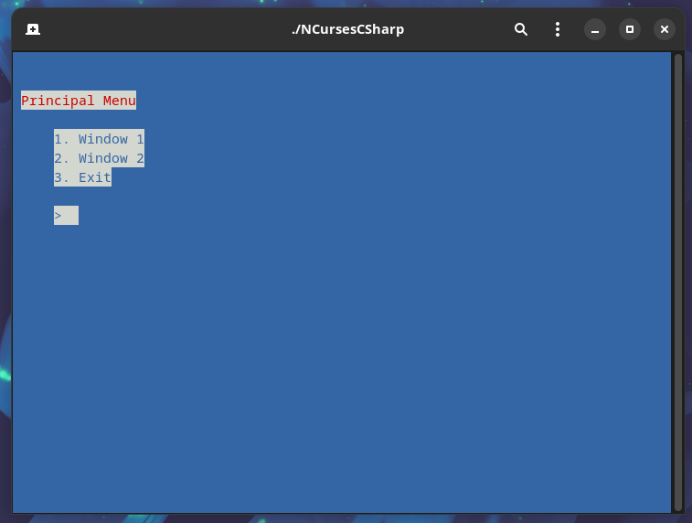

<h1 align="center">NCurses C#</h1>

   TUI (Text User Interface) application developed in C# using the C/C++ ncurses library.

  <small style="color: tomato;"><b>NOTE:</b> The development of this application is entirely for study purposes and not something fixed, if you intend to do some <b>TUI</b> project in C# look for an appropriate library, otherwise you want to use ncurses and I recommend studying C/C++ and the library itself, there you have more control.</small>

## Table of Contents

- [Pre-requisites](#pre-requisites)
- [Overview](#overview)
- [License](#license)
- [Technologies](#technologies)
- [Author](#author)

# Pre-requisites

Install the [.NET 6](https://dotnet.microsoft.com/en-us/download/dotnet/6.0) to run the project on your machine.

## Overview

# License

The license used in project is the [MIT](LICENSE.md).

# Technologies

- [.NET 6](https://dotnet.microsoft.com/en-us/download/dotnet/6.0)
- [NCurses](https://tldp.org/HOWTO/NCURSES-Programming-HOWTO/)

# Author

### Gabriel Mariz

- [profile](https://github.com/gabimariz) - Email and others medias
- [linkedIn](https://linkedin.com/in/mariz5g) - Professional social networking
